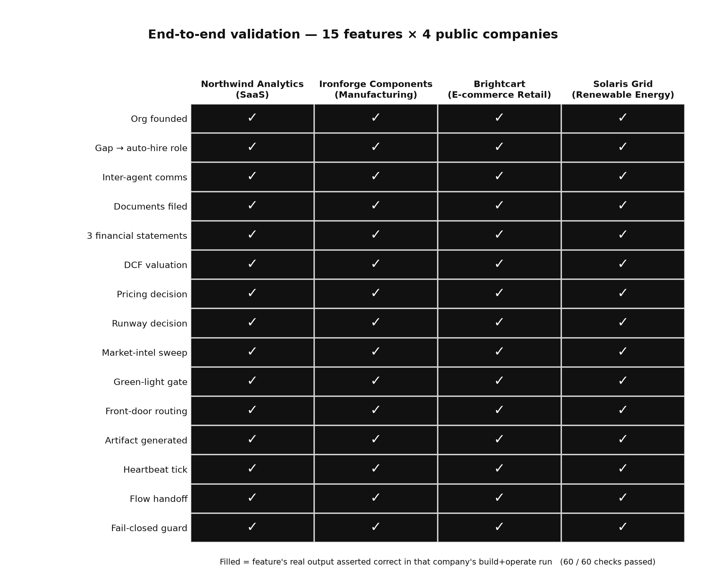
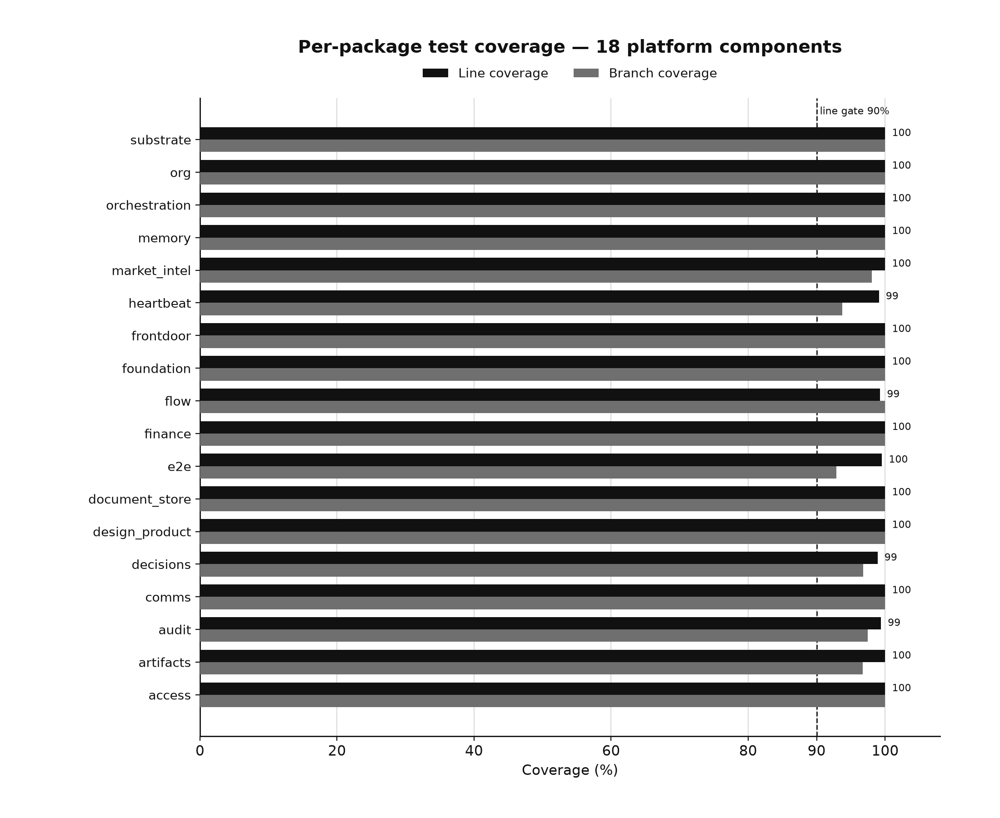
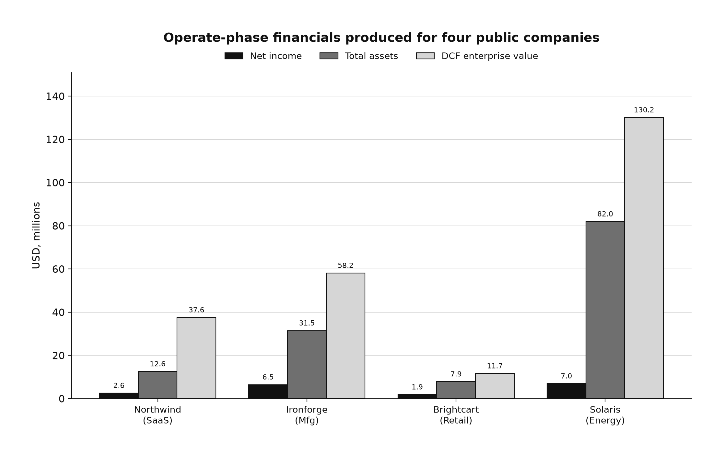
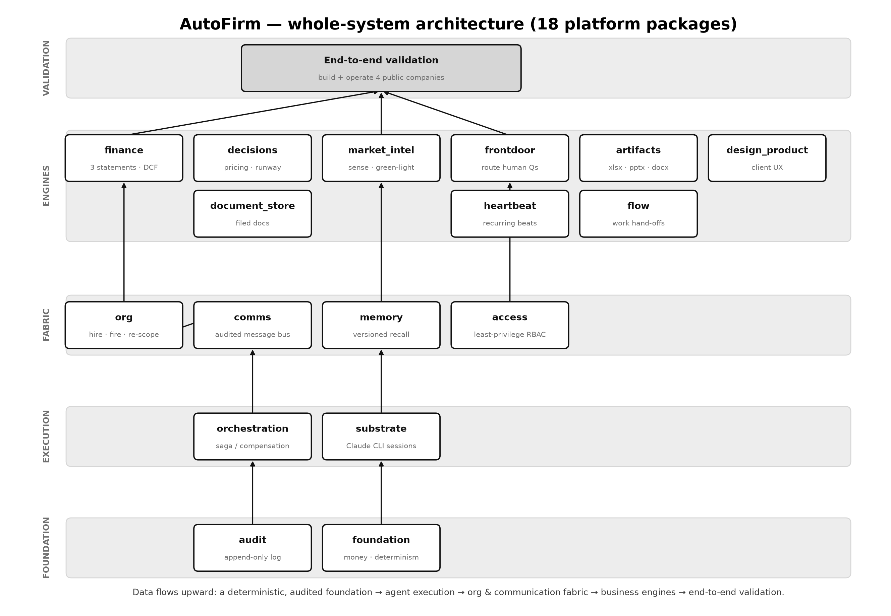
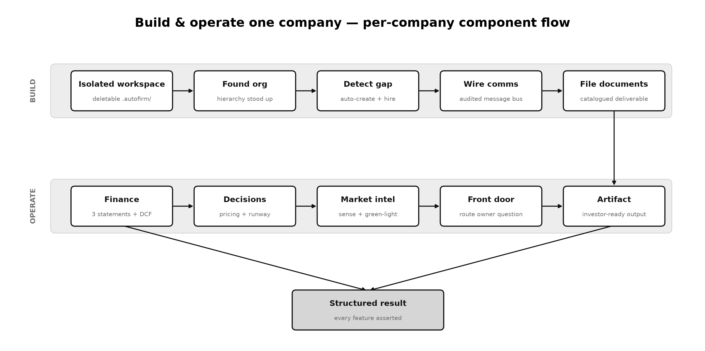
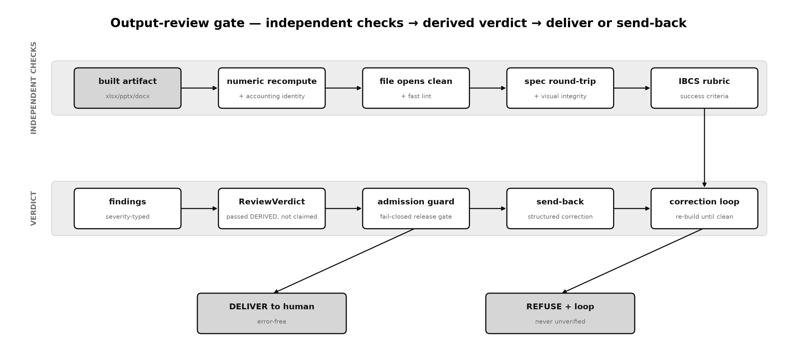
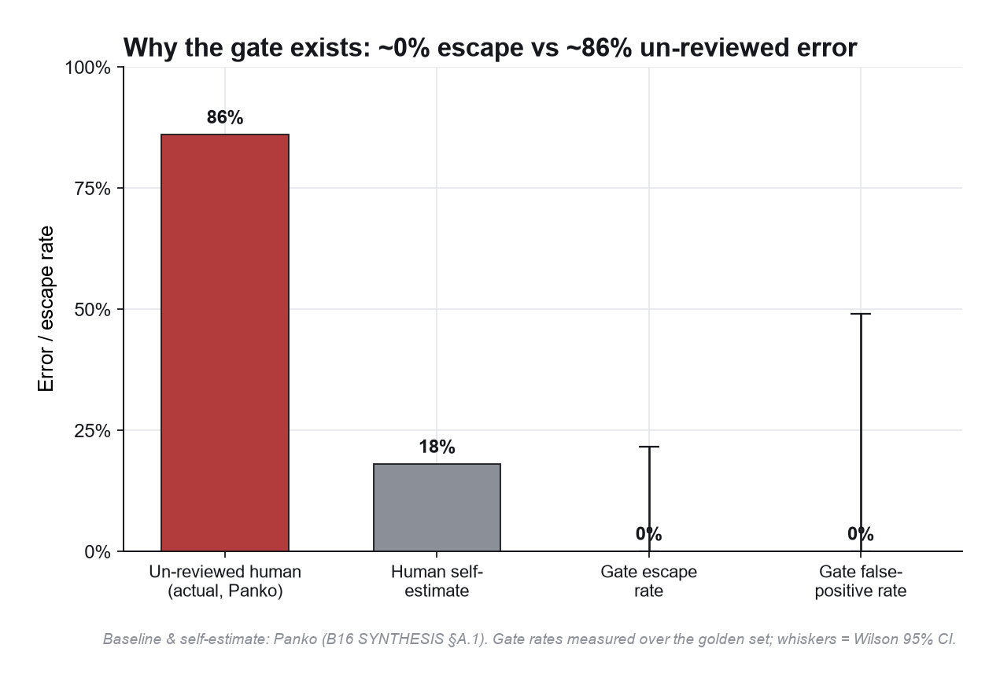
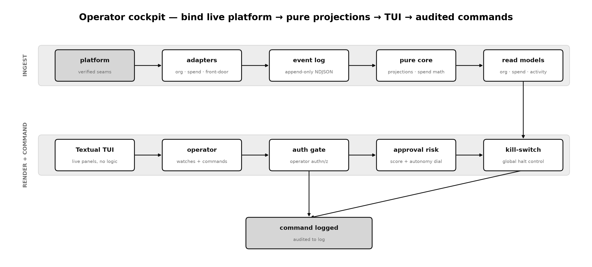
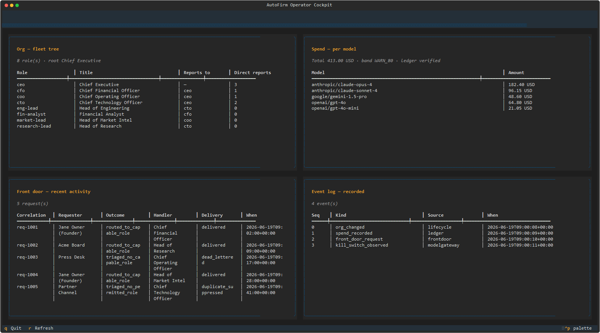
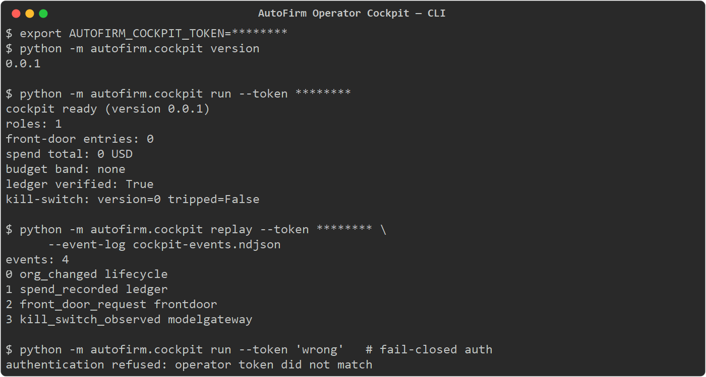

<h1 align="center">AutoFirm</h1>

<p align="center">
  <strong>AutoFirm autonomously <em>builds</em> and <em>operates</em> real companies end-to-end —
  as a self-organising company of AI agents.</strong>
</p>

<p align="center">
  You give it an idea. It stands up the org, hires the roles, wires the
  communication, runs the finances, makes the pricing and runway calls, senses the
  market, routes the owner's questions, and produces investor-ready artifacts —
  every decision audited, deterministic, and explainable.
</p>

<p align="center">
  
  
  
  
</p>

---

## Proven, not promised

AutoFirm has been validated end-to-end by **building and then operating four
genuinely different companies** — a B2B SaaS firm, an industrial manufacturer, a
direct-to-consumer retailer, and a renewable-energy utility — entirely from
**public-data-only** figures. For each one the platform exercises **15 distinct
capabilities** and asserts the **real output** of every one. All four companies
came back fully green: **60 / 60 feature checks correct.**



The numbers behind the badge:

| Evidence | Result |
| --- | --- |
| Automated tests (all passing) | **2,866** |
| Total coverage (line + branch mode) | **99.73%** across 26 packages |
| Companies built **and** operated | **4** (SaaS · manufacturing · retail · energy) |
| Feature checks asserted correct | **60 / 60** (15 capabilities × 4 companies) |
| Build+operate reproducibility | **byte-for-byte deterministic** (5 runs → 1 hash) |

Coverage is high **and uniform** — not propped up by any single package:



These aren't toy runs. The finance engine articulates three tying statements and a
DCF valuation for each company — real, company-shaped outputs across four very
different business models:



> The headline figures above are the live suite measured on this tree
> (`2,866` tests passing, `99.73%` combined line+branch coverage). The committed
> statistical showcase — the full per-package table, the determinism proof, and the
> graphs — lives in
> **[`evidence/stats/statistical_evidence.md`](evidence/stats/statistical_evidence.md)**
> and every figure regenerates from real runs via
> `python evidence/generators/run_all.py`.

## What AutoFirm does

You give AutoFirm an idea; it does the unglamorous, end-to-end work of turning that
idea into a real, operating company — and it does it as a **company of AI agents**
that behaves like a real org:

- **Builds the company.** Founds the org hierarchy, **detects capability gaps and
  auto-creates + hires** the missing roles, wires an audited inter-agent message
  bus, and files every deliverable into a catalogued document store.
- **Operates the company.** Runs **accurate finance** (three tying statements, DCF
  valuation, zero numerical errors), makes **explainable pricing and runway
  decisions**, senses the market and issues **green-light go/no-go verdicts**,
  **routes the owner's questions** to the right team, and generates
  **investor-ready artifacts** (xlsx / pptx / docx).
- **Self-organises.** A strict, audited hierarchy of agents that can be **hired,
  fired, and re-scoped** as the company's needs change — every manager owns the
  charter of its reports; new niche roles are created when gaps appear.
- **Runs autonomously.** Orchestrated **Claude Code CLI sessions** hand off cleanly
  when context runs out and **auto-resume**, so a company can run for days
  unattended — fully logged, append-only, and traceable.

## How it's built — the architecture

Twenty-six platform packages, laid out in flow order and read bottom-to-top like the
data flow: a **deterministic, audited foundation**, the **agent execution
substrate**, the **org + communication fabric**, the **business-capability
engines**, a single **operator control plane**, the **activation/composition
layer**, and the **end-to-end validation** that exercises them all on real
companies.



Every company is built and operated inside its **own isolated, deletable
workspace**, then emits a structured, machine-readable result with **every feature
asserted** — the per-company flow:



| Layer | Packages | Responsibility |
| --- | --- | --- |
| Foundation | `foundation` · `audit` | exact money/determinism primitives; append-only audit log |
| Execution | `substrate` · `orchestration` · `modelgateway` · `costledger` | Claude CLI sessions; saga / compensation loops; cross-model router; exact spend ledger |
| Fabric | `org` · `comms` · `memory` · `knowledge` · `capabilities` · `access` | dynamic org; audited bus; versioned recall; shared-knowledge substrate; capability registry; least-privilege RBAC |
| Engines | `finance` · `decisions` · `market_intel` · `frontdoor` · `artifacts` · `output_review` · `design_product` · `document_store` · `heartbeat` · `flow` | the business capabilities and the human-output review gate |
| Control | `cockpit` | read-only operator terminal; kill-switch surface |
| Activation | `bootstrap` · `runtime` | idempotent env converge; one composition root that wires and supervises the platform |
| Validation | `e2e` | build + operate the four public companies, assert every output |

## One command to bring the platform up

The whole platform comes up behind a single operator command — `autofirm up`. Activation
is split in two: a **convergence** phase that brings the environment to a known-good state,
and a **composition** phase that wires every package into one cohesive `Platform` object and
supervises its long-lived loops.


Convergence is **idempotent and fail-closed**: a pure `check()` predicate gates a
forward-only, re-entrant `apply()`, so re-running `autofirm up` on an already-converged
machine is a **provable no-op** rather than a second mutating pass, and a step that cannot
converge degrades closed instead of leaving a half-built environment. Composition uses a
single **pure-DI composition root** — no package reaches across the seam to wire itself —
and the platform proves it actually serves with a **readiness self-test** before reporting
`up`. `autofirm status` is a read-only CLI surface; `autofirm down` tears the run down.

## The human-facing output-review gate

Anything an AI org sends to a human — a board deck, a model, a P&L — is only as
trustworthy as the last check between the agent and the reader. AutoFirm puts an
**independent, fail-closed gate** at that seam: **nothing reaches a human until a
floor of deterministic checks all pass.** Seven mechanical reviewers run on every
artifact — **accounting identity** (assets = liabilities + equity), **spec
round-trip**, **numeric recompute**, **file-opens-clean** (the OOXML actually
opens), **FAST lint** (formula/orphan/consistency), **IBCS** notation, and
**visual integrity** (no truncated axes, overlap, or clipping). Their outcome is a
single `ReviewVerdict` whose `passed` field is **derived** from the findings rather
than set — so a "green but wrong" verdict is structurally unconstructible. A failed
artifact enters a **bounded correction loop**, and **release authority is
load-bearing**: the librarian delivery seam refuses to hand anything to a human
without a passing verdict.





An un-reviewed human spreadsheet carries an error a large fraction of the time; the
independent gate's **measured escape rate is 0**. Against the labelled golden set the
gate scores **100% detection on every must-block defect class** (MECHANICAL /
PURE_LOGIC / OMISSION), **0 / 14 escapes** of planted defects, and **0 / 4 false
positives** on known-good controls. It is **deterministic over 3,600 repeated
reviews** (one unique verdict digest), holds **100% line and branch coverage**, and
is mutation-proven to **0 surviving mutants across 25 modules**.

> Full methodology, statistics, and per-defect outcomes live in
> **[`evidence/output_review/README.md`](evidence/output_review/README.md)**.

## The operator cockpit

The **operator cockpit** ([`src/autofirm/cockpit/`](src/autofirm/cockpit/)) is a
founder-facing, terminal-first, **read-only** control plane for watching a running
AutoFirm org. It is an **add-only consumer**: a single read-only adapter seam binds
the platform's on-main subsystems — front-door activity, the org snapshot, cost-ledger
spend, and the kill-switch epoch — and the cockpit only ever *observes* them, never
mutating on-main state. It is layered low→high (`core` pure decision logic → `eventlog`
append-only NDJSON → `adapters` → `readmodels` → `composition` DI root → `transport`
CLI + auth gate → `tui` Textual widgets), and is import-contract-fenced so the adapters
remain the only seam onto on-main.



Here is the cockpit running against genuine, real-shaped data — not a mockup. Every frame is
produced by driving the actual `CockpitApp` Textual TUI / real CLI through the on-main
composition root, seeded through the genuine domain contracts (`DynamicOrg`, the hash-chained
`AppendOnlyCostLedger`, the front-door provenance trail, the kill-switch epoch). The inputs are
**synthetic, public-data-only** values flowing through the *same* contracts the live platform
uses; the in-memory sources are the documented swap seam, so the rendering path is real.

| | |
| --- | --- |
|  | **Healthy operating run.** The 2×2 panel grid: an 8-role org tree (CEO → C-suite → leads), $413.00 spend across five Anthropic / OpenAI / Google models with the budget band classified `WARN_80`, a verified ledger, five front-door requests (including a `dead_lettered` incident kept visible), and four recorded audit events. |
|  | **Budget-breach run.** Extra spend pushes the total to $494.05 of the $500 budget, and the same deterministic classifier re-bands it `CRIT_95` — the rest of the org / front-door / audit context is unchanged. |
|  | **CLI: snapshot, replay, and fail-closed auth.** `version`, an authenticated `run` snapshot (kill-switch line, spend, budget band, ledger-verify), a `replay` of the real append-only event log, and a `run --token 'wrong'` that is **refused** — `authentication refused: operator token did not match`. |

> Honest caveat (carried from [`evidence/cockpit-screenshots/README.md`](evidence/cockpit-screenshots/README.md)):
> Textual's *headless* SVG export does not paint docked-header content, so the prominent
> kill-switch ARMED/TRIPPED badge a running terminal shows in the header is instead evidenced
> via the CLI `run` snapshot's `kill-switch:` line in the third shot.

Install the cockpit's optional runtime deps (`textual`, `rich` — MIT-licensed, kept out
of the deterministic runtime closure):

```bash
pip install -e ".[cockpit]"
```

There is no console script; the entry point is `python -m autofirm.cockpit <subcommand>`:

```bash
# Print the cockpit version (no auth, leaks nothing).
python -m autofirm.cockpit version

# Auth-gated commands. The EXPECTED secret is read from the environment;
# the operator PRESENTS a token via --token. Use a real secret, not this placeholder.
export AUTOFIRM_COCKPIT_TOKEN=<operator-secret>

# Assemble the cockpit and print a read-only status snapshot.
python -m autofirm.cockpit run     --token <operator-secret>

# Replay the recorded cockpit events from the event log.
python -m autofirm.cockpit replay  --token <operator-secret>

# Launch the read-only Textual TUI (live org / spend / front-door / kill-switch /
# event-log panels, ~2s refresh).
AUTOFIRM_COCKPIT_TOKEN=<operator-secret> python -m autofirm.cockpit tui --token <operator-secret>
```

The auth-gated commands (`run` / `replay` / `tui`) are **fail-closed** (CLAUDE.md §5.6):
a missing/blank configured secret, a missing/blank presented token, or any mismatch all
refuse with a non-zero exit and emit **no** data, using a constant-time comparison; no
token is ever logged. `run`/`replay`/`tui` accept `--event-log <path>` and
`--currency <ISO-4217>` (defaulting to `cockpit-events.ndjson` and `USD`). Every
non-widget cockpit module is mutation-hardened to a **1.0000** score, the TUI is proven
by a live Textual Pilot end-to-end suite, and the whole package is add-only.

## Principles (non-negotiable)

AutoFirm is built under a strict, self-activating engineering contract
([`CLAUDE.md`](CLAUDE.md)):

- **Institution-grade & secure by default.** Fail-closed, least privilege,
  append-only audit log, a maintained [STRIDE threat model](docs/threat-model.md),
  and a global kill-switch.
- **Tests with teeth.** Adversarial, property-based, mutation-tested suites — a
  green suite of easy tests is treated as worthless; the **mutation score**, not the
  pass rate, is the acceptance signal.
- **Deterministic & explainable.** Reproducible to the unit; every decision
  justifies itself (which rule fired, which feature drove the score).
- **General, never overfit.** It must work for *any* company — proven across four
  deliberately different industries, not one demo.
- **Evidence-driven.** Competing approaches run on their own branches; only the
  measured winner lands on an always-clean `main`.
- **Rigorously researched.** Every design decision is grounded in a peer-reviewed
  research library ([`docs/research/`](docs/research/)) — the foundation the build
  stands on.

## Repository layout

```
CLAUDE.md            The binding engineering contract & operating mode
docs/architecture/   Ratified architecture, ADRs & typed data contracts
docs/research/       The deep research library — one folder per source
docs/threat-model.md Maintained STRIDE threat model
docs/roadmap.md      Gated phase plan with live status
src/autofirm/        The 26 platform packages (deterministic core + engines)
tests/               Adversarial / property / mutation test suites (2,866 tests)
evidence/            Self-contained statistical & visual evidence showcase
```

## License

[MIT](LICENSE) © 2026 Alex Kapadia
